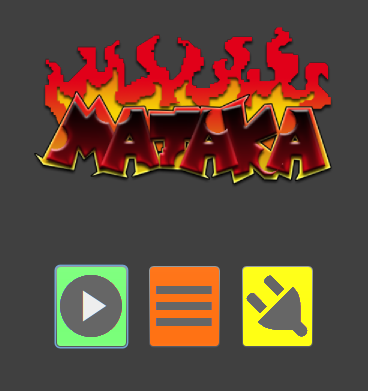
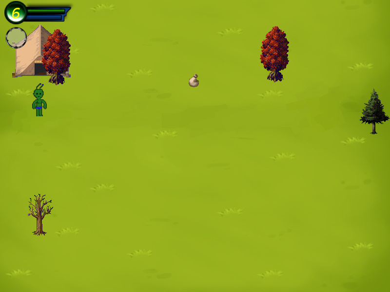
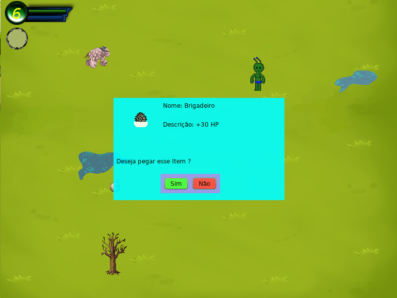
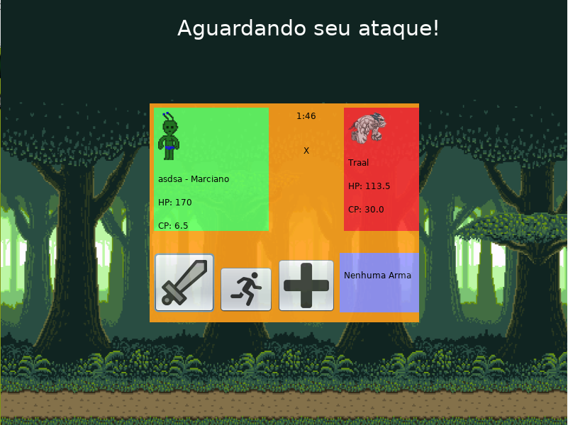

## Mataka RPG

This project was about a final work of the object orientation class, in college. 
It's a random world RPG with 6 character choices, countless enemies, weapons and items. 
In addition, of course, fun battles that evolve your character.

Developed by Lucas Augusto de Souza

### Menu

### Gameplay

### Item

### Battle
